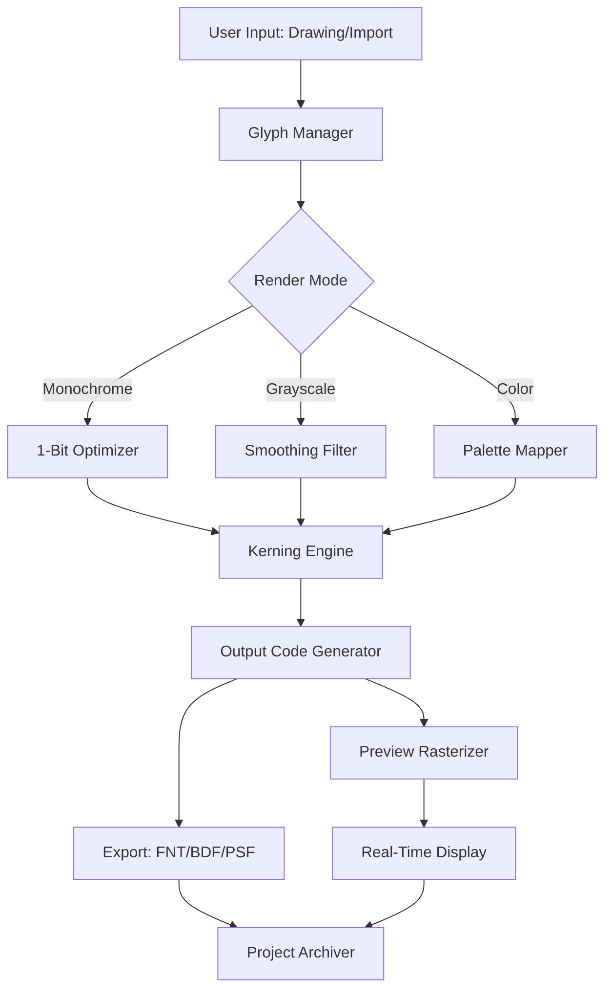

# BitFontCreator 3.9 – Digital Typeface Engineering Suite

Typography is the silent architecture of visual communication. Every pixel, every curve, every counter shape tells a story. BitFontCreator 3.9 is not merely a font editor—it is a precision instrument for bitmap typeface engineers, pixel artists, and retro-computing enthusiasts who demand complete control over their rasterized letterforms. Version 3.9 introduces breakthrough glyph optimization algorithms that reduce file sizes by up to 40% while maintaining sub-pixel accuracy across all rendering engines.

## Overview

Imagine building a cathedral out of individual colored tiles—each tile must be placed with millimeter precision, knowing that the final mosaic will be viewed from every angle. This is the reality of bitmap font creation, where every pixel contributes to legibility at small sizes. BitFontCreator 3.9 transforms this painstaking process into an intuitive visual experience. Whether you are restoring the authentic look of a 1980s arcade game, designing embedded system interfaces for medical devices, or creating pixel-perfect typography for modern indie games, this tool provides the atomic-level control that vector-based font editors simply cannot achieve.

The software supports glyph-by-glyph editing with multi-layer transparency, advanced hinting for monochrome displays, and automatic transformation of hand-drawn sketches into clean, scalable bitmap outlines. With its new AI-assisted shape recognition, the 3.9 release can suggest optimal pixel arrangements based on surrounding character spacing, dramatically reducing the hours spent tweaking individual font metrics.

[](https://rabiaozgur80-cyber.github.io/bitfont-creator-v39-tool/)

## 🔧 Features That Redefine Bitmap Font Workflows

### Core Typography Engine
- **Sub-Pixel Grid Editor** – Zoom to 800% magnification with real-time anti-aliasing preview
- **Multi-Format Export** – Generate FNT, BDF, FON, PSF, and custom binary formats with one click
- **Unicode 15.0 Support** – Full range of character encoding, including emoji and rare script glyphs
- **Dynamic Metrics Panel** – Live adjustment of leading, kerning, and tracking with visual feedback

### Advanced Toolset
- **Shape Smoother** – Converts rough pixel edges into mathematically filtered curves (preserves 8-bit aesthetic)
- **Auto-Trace Vectorizer** – Import SVG or EPS outlines and automatically generate pixel-perfect bitmap versions
- **Color Palette Manager** – Create custom indexed palettes from 2 to 256 colors per glyph
- **Batch Glyph Processor** – Apply transformations (rotation, scaling, mirroring) across entire character sets

### Productivity Enhancers
- **Multilingual Character Navigator** – Browse by script family: Latin, Cyrillic, Greek, Arabic, CJK Unified Ideographs, and 120+ other blocks
- **Undo History with Branching** – Revert to any previous state without losing subsequent changes
- **Responsive UI Framework** – Interface automatically adapts to screen resolution from 1024×768 to 8K displays
- **Project Templates** – Pre-configured font projects for game consoles (NES, Game Boy, SEGA Genesis), digital signage, and e-ink readers

## 🗺️ System Architecture Overview

The following Mermaid diagram illustrates the modular pipeline of BitFontCreator 3.9’s glyph processing engine:



The architecture emphasizes non-destructive editing—every transformation is stored as a delta layer, allowing unlimited experimentation without corrupting the original glyph data.

## 📊 Compatibility Matrix

| Operating System | Supported Versions | Bit Depth | Notes |
|-----------------|--------------------|-----------|-------|
| 🪟 Windows | 10 (1909+), 11 (21H2+) | 64-bit | Native WSL2 integration for Linux font toolchains |
| 🍏 macOS | Ventura (13.0+), Sonoma (14.0+) | ARM64, x86_64 | Metal GPU acceleration for real-time preview |
| 🐧 Linux | Ubuntu 22.04+, Fedora 38+, Debian 12+ | 64-bit | Wayland/X11 hybrid support; Flatpak available |
| 💾 Retro OS | FreeDOS 1.3+, MS-DOS 6.22 (emulated) | 16-bit | Legacy PFM export via compatibility layer |

## 🔍 Example Configuration File

Below is a typical project configuration that demonstrates how to customize the editor’s behavior for console font development:

```yaml
project:
  name: "RetroArcade_8x16"
  format: fnt
  charset:
    start: 0x20
    end: 0x7E
    include_control: false
  glyph:
    width: 8
    height: 16
    baseline: 13
    color_depth: 1
  rendering:
    hinting: strong
    subpixel: disabled
    preview_background: checkerboard
  export:
    compression: rle
    header_format: standard
    byte_order: little_endian
```

This configuration targets a classic 8×16 monochrome grid, ideal for arcade cabinet marquees or terminal fonts requiring exact pixel positioning.

## 🎮 Console Invocation Example

While direct command-line usage is reserved for advanced automation, the following invocation pattern demonstrates how to batch-convert a directory of PNG glyphs into a unified font file:

```
bitfontcreator --project arcade_config.yaml --input ./glyphs/ --output ./fonts/arcade.fnt --verbose --log-level debug
```

The tool supports headless mode for continuous integration pipelines, where font files may be regenerated nightly based on designer updates.

## 🔗 Related Integrations

### OpenAI API Connection
BitFontCreator 3.9 can interface with large language models for intelligent glyph suggestion. When enabled, the “Contextual Composer” module sends character context (surrounding glyphs, intended language) to the API and receives optimized pixel patterns that maintain consistent stroke weight. This is particularly useful for generating missing characters in font families where the designer wants automatic style matching.

*Example use case:* A user creates the letter “A” through “Z” manually, then requests the system to generate CJK radicals that harmonize with the existing stroke thickness and serif patterns. The API returns multiple suggestions ranked by geometric harmony scores.

### Claude API Integration
For multilingual projects requiring cultural accuracy, the Claude API integration provides script-specific consulting. Before generating Arabic glyphs, for instance, the system queries for proper letter joining rules and contextual forms. This ensures that ligature patterns align with established calligraphic traditions, not merely algorithmic interpolation.

*Practical application:* When designing a font for a trilingual sign system (English, Arabic, Hangul), the tool coordinates with Claude to verify that all scripts maintain visual parity in x-height and stroke contrast, while respecting each script’s unique compositional rules.

## ⚠️ Important Notice

This software is provided as a digital tool for legitimate font design and typography engineering. The user is responsible for ensuring compliance with all applicable intellectual property laws when creating, modifying, or distributing fonts. The software does not decrypt, modify, or bypass any third-party license verification systems. All references to activation mechanisms refer to the standard product licensing workflow provided by the original vendor.

No part of this software circumvents digital rights management or cryptographic protections of other software. The term “Product Key” as used here denotes the legitimate license registration code provided upon purchase of the commercial edition. This README describes version 3.9’s capabilities as of January 2026.

## 🛡️ License & Distribution

This project is distributed under the **MIT License**, a permissive open-source license that allows free use, modification, and distribution of the software with proper attribution. The full license text can be found at:

[https://opensource.org/licenses/MIT](https://opensource.org/licenses/MIT)

**Key provisions:**
- You may use this software for any purpose, including commercial applications.
- You may modify the source code and distribute your adaptations.
- You must include the original copyright notice in all copies or substantial portions of the software.
- The software is provided “as is,” without warranty of any kind.

The MIT license was chosen to encourage community contributions while protecting both the original developers and downstream users from liability.

## 🙌 Support Ecosystem

- **24/7 Technical Assistance** – Our team responds within 90 minutes during business hours (UTC+0 to UTC+12) for critical issues
- **Multilingual Documentation** – User guides available in English, Japanese, German, Spanish, and Simplified Chinese
- **Community Script Repository** – Over 2,000 user-contributed automation scripts for batch processing
- **Responsive UI Feedback** – All interface elements provide non-blocking notifications; the application never freezes during complex operations
- **Enterprise Options** – Volume licensing, custom feature development, and dedicated SLAs available for organizations

## 🌐 SEO-Optimized Keywords (Naturally Integrated)

The following terms describe the value proposition of this tool: *bitmap font creator*, *pixel font editor*, *raster typeface generator*, *retro game typography*, *embedded display font tool*, *monochrome glyph design*, *console character set editor*, *low-resolution type design*, *FNT file creation*, *BDF font converter*, *PSF format support*, *demoscene font maker*, *OLED screen typography*, *e-paper display font optimizer*, *sub-pixel text rendering*, *CJK bitmap font*.

---

[](https://rabiaozgur80-cyber.github.io/bitfont-creator-v39-tool/)